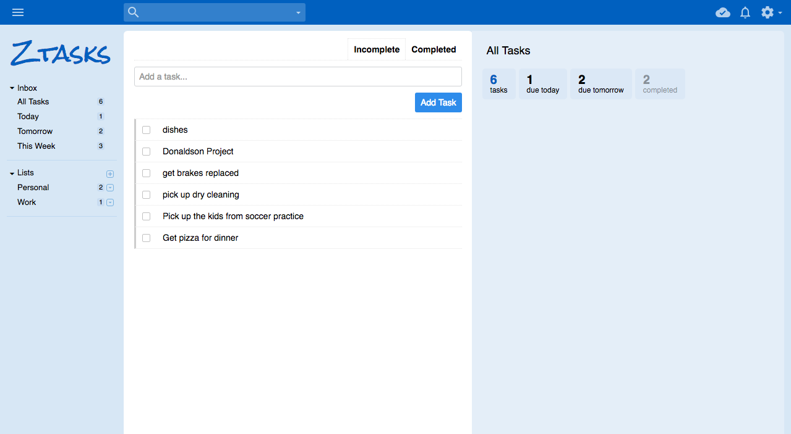
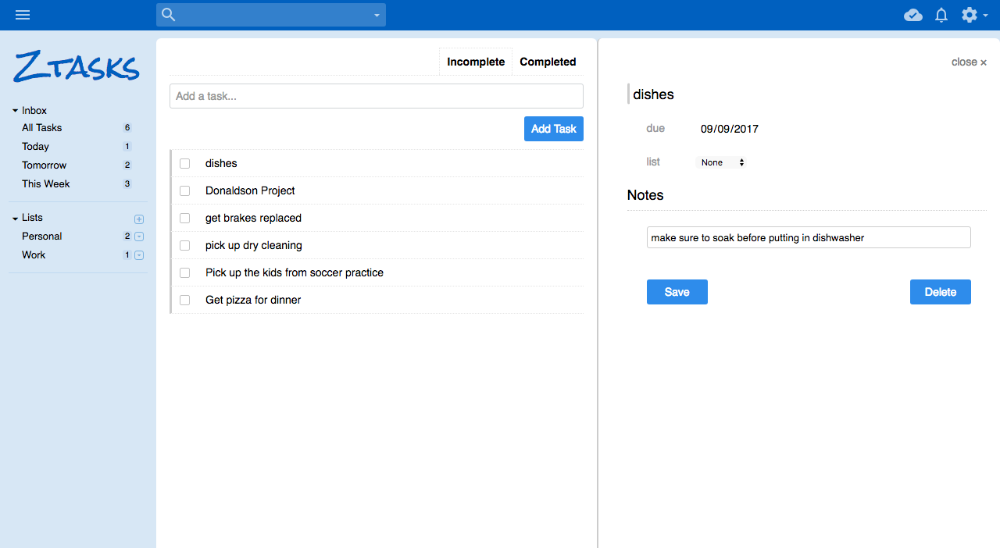
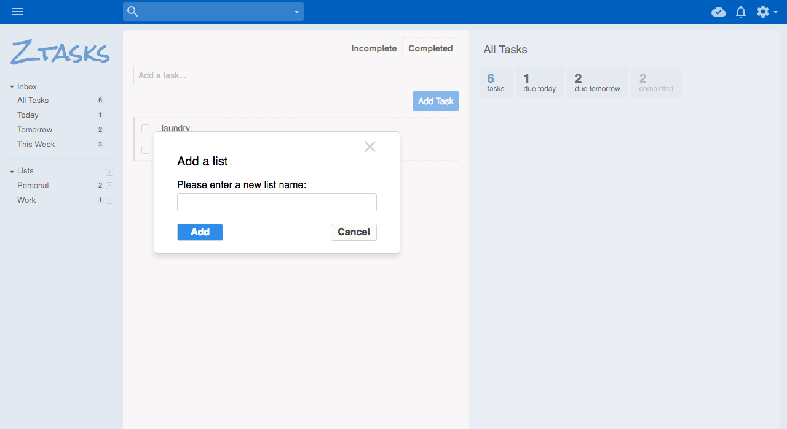

# Ztasks

[Ztasks](http://ztasks.herokuapp.com)

Ztasks is a web app clone of Remember the Milk. It uses Ruby on Rails as the backend, a PostgreSQL database, and React.js with a Redux architectural framework as the frontend.

## Development

Lists belong to Users, Tasks belong to Lists, and Tasks have various attributes: title, due date, completed status, time estimate, and notes.

### Lists

The Lists are stored in their own table in the database, with a user_id, correlating to the user which they belong to. When the user logs in, an API call is made and the Lists of the logged in user are returned and stored.

The data from the collected Lists is used to render the ListIndex component, the ListIndexItem component, and is used for the ListSummary Component as well.
The ListIndex Component is just a collection of all of the Lists located in the Sidebar of the Page.
The ListIndexItem Component renders the title, number of tasks, and contains the dropdown menu for editing or deleting a list.
The ListSummary Component appears on the right side of the page. Its contents depend on the currently selected list, display information about that list.

### Tasks

The TaskIndex Component is displayed depending on which List is currently selected. There is also the option to view completed or incomplete Tasks within the component.
The Tasks can also be filtered by **Today, Tomorrow**, or **This Week**.
Upon selection of an individual task, the TaskDetail Component will render. Within this component, there are options of editing and deleting the Task.

### UI

The UI was designed to look as similar to Remember The Milk as possible. It was developed using plain CSS without any libraries.

## Looking Forward

This is just the beginning. In the future there are more features I would like to implement.

### Email

I would like to create an email reminder feature, which allows the app to email the user within a certain time frame of a tasks due date.

### Better Search

Currently the search only searches substrings. I would like to implement a much more intuitive search so that the user will not need to be as accurate with their search term.

### SubTasks

I would like to implement the ability to add subtasks to a task. I would likely do this by creating another table on the backend which would have a foreign key pointing to the task each subtask belongs to.
